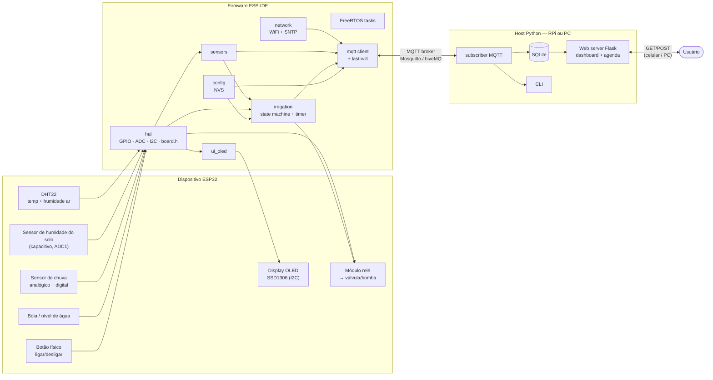
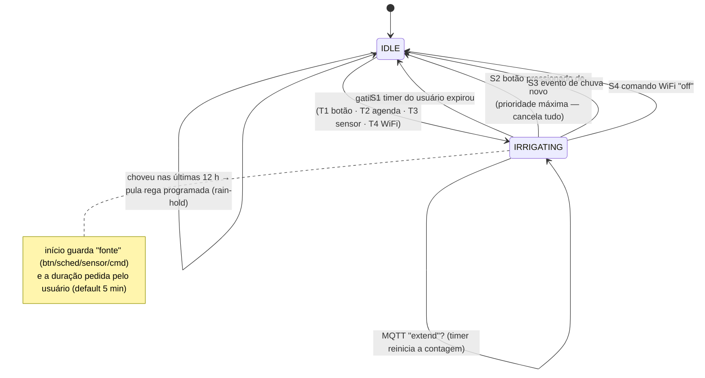
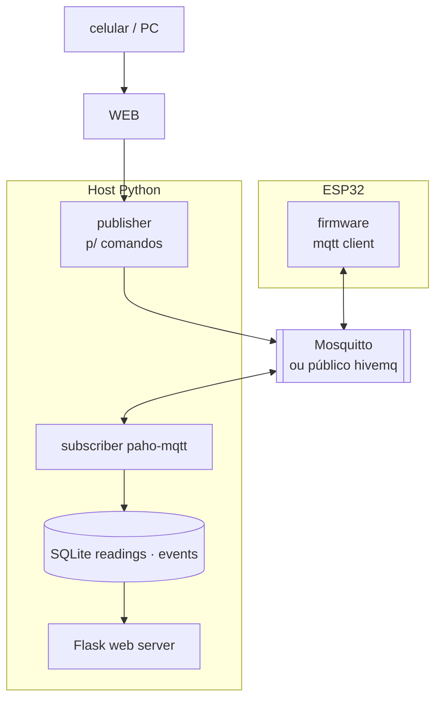
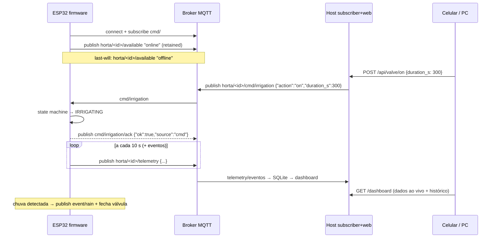

# Arquitetura — smart-horta

> **Status**: visão final/alvo (aprovada). O repo está em construção — a
> seção [Estado atual](#6-estado-atual-vs-alvo) marca o que já existe.
> Referência de tópicos MQTT: [`docs/mqtt-topics.md`](mqtt-topics.md).

## Índice

1. [Visão geral](#1-visão-geral)
2. [Requisitos funcionais](#2-requisitos-funcionais)
3. [Diagrama de blocos do sistema](#3-diagrama-de-blocos-do-sistema)
4. [Firmware — camadas e componentes](#4-firmware--camadas-e-componentes)
5. [Máquina de estados da irrigação](#5-máquina-de-estados-da-irrigação)
6. [Estado atual vs. alvo](#6-estado-atual-vs-alvo)
7. [Host (Python) — dashboard web via MQTT](#7-host-python--dashboard-web-via-mqtt)
8. [Fluxo de comunicação MQTT](#8-fluxo-de-comunicação-mqtt)
9. [Persistência, hora e resiliência](#9-persistência-hora-e-resiliência)
10. [Decisões de arquitetura (ADRs)](#10-decisões-de-arquitetura-adrs)
11. [Backlog / funcionalidades futuras](#11-backlog--funcionalidades-futuras)

---

## 1. Visão geral

O **smart-horta** é um controlador de irrigação para horta/jardim construído
sobre um ESP32. Ele:

- lê sensores de **temperatura e humidade do ar** (DHT22), **humidade do solo**
  (capacitivo), **chuva** (analógica + binária, para saber *se choveu no dia* e
  a intensidade) e **nível de água** do reservatório (bóia);
- **liga a irrigação** por 4 gatilhos: botão físico, agenda semanal
  (dia/hora), limiar de sensor (ex.: humidade < X%) ou comando via WiFi;
- **desliga** por 4 caminhos: temporizador do usuário (ex.: 5 min), o mesmo
  botão (prioridade máxima, cancela tudo), evento do sensor de chuva
  (começou a chover → desliga) ou comando via WiFi;
- mostra os dados num **display OLED** e envia **telemetria via WiFi/MQTT**
  para um servidor (computador/Raspberry Pi) acessível do celular ou PC;
- é **programado à distância** via WiFi (agenda, limiares, duração).

Princípio central: o dispositivo é **autônomo na borda** — ele guarda a
configuração (agenda, limiares) na memória NVS e decide sozinho, mesmo sem
WiFi. O servidor host é para **monitorar, programar e visualizar histórico**;
se ele cair, a horta continua sendo regada.

## 2. Requisitos funcionais

### 2.1 Ativação da irrigação (quatro gatilhos)

| # | Gatilho | Fonte | Detalhe |
|---|---------|-------|---------|
| T1 | Botão físico | GPIO (pull-up) | Liga **imediatamente** ao pressionar |
| T2 | Agenda semanal | Config local (NVS) | Ex.: toda 2ª/4ª/6ª-feira às 06:00; precisão por SNTP |
| T3 | Limiar de sensor | DHT22 / solo | Ex.: humidade do solo < 30% → irrigar |
| T4 | Comando WiFi | MQTT → host/app | Ativação manual à distância |

### 2.2 Desativação da irrigação (quatro caminhos)

| # | Caminho | Prioridade | Detalhe |
|---|---------|-----------|---------|
| S1 | Temporizador do usuário | — | **Qualquer** fonte de ativação desliga após N minutos (duração configurável por gatilho) |
| S2 | Botão novamente | **Máxima** | Cancela tudo: agenda, sensor, WiFi — desliga na hora |
| S3 | Sensor de chuva | Alta | Começou a chover → desliga (e adia regas programadas) |
| S4 | Comando WiFi | Alta | Desativação manual à distância |

### 2.3 Interface local e remota

- **Display local (OLED SSD1306, I2C)**: temp/humidade do ar, humidade do
  solo, estado da válvula e contagem regressiva do temporizador de desligar.
- **Telemetria via WiFi**: publicações MQTT periódicas + eventos (chuva,
  válvula aberta/fechada), visíveis no dashboard web do host.
- **Programação via WiFi**: mensagens MQTT de comando do host para agenda,
  limiares, durações e comandos manuais.

## 3. Diagrama de blocos do sistema



## 4. Firmware — camadas e componentes

Regra de ouro: **todo acesso a sensor/atuador passa pela `hal`** — assim o mesmo
código de aplicação roda no Wokwi (partes simuladas) e no hardware real.

```
firmware/
├── CMakeLists.txt
├── sdkconfig.defaults
├── wokwi.toml · diagram.json · irrigar.test.yaml
├── main/                    # app_main: init + coordenação das tasks
├── components/
│   ├── hal/                 # GPIO/ADC/I2C + include/board.h (mapa de pinos)
│   ├── sensors/             # DHT22 · solo (ADC) · chuva (ADC+digital) · nível
│   ├── ui_oled/             # SSD1306 I2C: telas de monitor + irrigação
│   ├── irrigation/          # STATE MACHINE de decisão + timer de desligar
│   ├── config/              # NVS: agenda, limiares, durações, fail-safe reset
│   ├── network/             # WiFi STA (Wokwi-GUEST) + SNTP (hora p/ agenda)
│   └── mqtt/                # esp-mqtt: telemetria, comandos, last-will, QoS
└── chips/                   # (opcional) WASM chip p/ parte de sensor faltante
```

| Componente | Responsabilidade (uma frase) |
|---|---|
| `hal` | Único ponto que "sabe" pinos e periféricos; expõe `board.h` + APIs `hal_*` |
| `sensors` | Leitura e normalização (°C, %, mV) dos 4 sensores, com debounce/cache |
| `ui_oled` | Renderiza status; independente do resto (só consome estruturas de dados) |
| `irrigation` | **O cérebro** — máquina de estados que mescla os 4 gatilhos e manda no relé |
| `config` | Persistência em NVS + validação; sobrevive a reboot e power-cycle |
| `network` | WiFi com auto-reconnect + SNTP (agenda depende de hora correta) |
| `mqtt` | JSON schemas de `docs/mqtt-topics.md`; ack de comandos; last-will |

### Mapa de pinos (alvo — `board.h` ↔ `diagram.json`)

| Função | GPIO | Nota |
|---|---|---|
| DHT22 (one-wire) | GPIO 15 | strapping pin — cuidado no boot |
| Botão ligar/desligar | GPIO 23 | pull-up interna, ativo LOW |
| Relé válvula/bomba | GPIO 18 | inativo = LOW = fechado (**fail-safe**) |
| LED status | GPIO 2 | on-board DevKit; pisca padrão de erro |
| OLED SSD1306 | GPIO 21/22 | I2C (SDA/SCL, barramento default) |
| Humidade do solo | GPIO 34 (ADC1_6) | input-only, sem pull-up |
| Chuva analógica | GPIO 35 (ADC1_7) | intensidade; pot no Wokwi |
| Chuva digital (binária) | GPIO 32 (ADC1_4) | comparador do módulo | 
| Bóia / nível | GPIO 33 (ADC1_5) | input com pull-up |

⚠️ Só ADC1 (GPIO32–39): **ADC2 fica indisponível com WiFi ativo**.

## 5. Máquina de estados da irrigação

Um único componente (`irrigation`) é dono do relé — ninguém mais toca o GPIO.
As fontes de ativação pedem para a máquina de estados; a máquina resolve
prioridade, guarda a **fonte** (usada pelo timer de desligar) e emite evento.



Regras de implementação (adotadas em `components/irrigation`):

1. **Botão = interrupção conceitual com prioridade máxima**: um pressionar
   mesmo em IRRIGATING → desliga, *não* cai no timer da fila.
2. **Chuva vence gatilhos automáticos e desliga qualquer rega em curso**
   (inclusive manual — a horta já recebeu água da chuva); se o usuário ligar
   manualmente *durante* a chuva, é permitido, mas sempre limitado pelo
   timer máximo e suspenso se a chuva intensificar.
3. `IDLE` → checa gatilhos nessa ordem a cada tick: agenda (se SNTP ok) →
   limiar sensor → nada. Comando WiFi chega **via fila** (thread-safe) e não
   na leitura, para evitar condições de corrida.
4. Antes de abrir válvula: checa **nível de água** — boia baixa bloqueia a
   bomba (proteção dry-run) e reporta via MQTT `event/reservoir_low`.
5. Falha de init de qualquer sensor crítico → válvula permanece fechada,
   LED pisca código de erro, telemetria com `status: "error"`.

## 6. Estado atual vs. alvo

| Módulo | Status no repo |
|---|---|
| `main/` (app_main + tasks de botão/DHT22) | ✅ existe (`main.c` monolítico) — refatorar p/ componentes |
| relé GPIO18 + pulse de 5s | ✅ parcial (teste `irrigar.test.yaml` passa) |
| `diagram.json` (DHT22, botão, relé, LED) | ✅ |
| `hal` · `board.h` | ⬜ próximo passo (extrair pinos do `main.c`) |
| `sensors` (solo, chuva, nível) · ADC | ⬜ |
| `ui_oled` · SSD1306 | ⬜ |
| `irrigation` (state machine completa) | ⬜ |
| `config` (NVS) · `network` (SNTP) | ⬜ |
| `mqtt` · WiFi | ⬜ |
| `host/` (subscriber, SQLite, Flask) | ⬜ (só `.gitkeep`) |
| `docs/bom.md`, `docs/wiring.md` | ⬜ (prometidos no roadmap, fases 10–11) |

Ver [`../TODO.md`](../TODO.md) para o roteiro fase a fase.

## 7. Host (Python) — dashboard web via MQTT

O host roda num PC ou Raspberry Pi na mesma rede (ou na internet via broker
público/VPS). Ele consolida: MQTT → armazenamento → apresentação.



- `subscriber` (paho-mqtt): consome `horta/+/telemetry`, `/event/#`, `/status`
  → grava no SQLite; QoS 1.
- `store`: SQLite (`readings(ts, device_id, metric, value)`,
  `events(ts, type, detail)`) — leve, sem server, já vem no Python.
- `web` (Flask): **dashboard com dados ao vivo + histórico em gráficos**
  (Chart.js) e formulário de programação:
  - agenda: dias da semana × hora; duração por dia;
  - limiares: humidade do solo/ar mínimas → irrigar;
  - manual: botões abrir/fechar válvula agora;
  - tudo acontece via **publish MQTT** em `horta/<id>/cmd/...`, ack em `/cmd/ack`.
- `cli`: `python -m host.main valve on|off`, `status`, `schedule set …`.

Segurança na rede local: no MVP o Mosquitto aceita conexão anônima **apenas
na LAN**. Para acesso fora de casa: broker em VPS com TLS + usuário/senha
(documentado em `docs/mqtt-topics.md` § segurança).

## 8. Fluxo de comunicação MQTT



Contrato completo de tópicos e payloads: [`docs/mqtt-topics.md`](mqtt-topics.md).

## 9. Persistência, hora e resiliência

| Preocupação | Solução |
|---|---|
| Agenda/limiares sobreviver a reboot | NVS (`components/config`), com CRC; reset de fábrica = segurar botão 10 s |
| Relógio p/ agenda | SNTP ao conectar WiFi; antes disso agenda fica "aguardando hora" (mostra no OLED) |
| WiFi caiu | auto-reconnect; irrigação **continua por agenda local** |
| Broker caiu | firmware continua autônomo; host reconecta |
| Task trava | watchdog ESP-IDF → relé fecha (fail-safe) |
| Reboot inesperado | no boot a válvula começa sempre fechada (estado "aberta" não persiste) |
| Chuva | evento digital fecha + adia regas automáticas por N h (rain-hold, config) |

## 10. Decisões de arquitetura (ADRs resumidos)

| ID | Decisão | Alternativas descartadas | Motivo |
|---|---|---|---|
| AD1 | ESP32 autônomo na borda (decide localmente) | host decide tudo | rega não pode morrer se WiFi/host cair |
| AD2 | Dashboard web **no host** (Flask) | AsyncWebServer no ESP32; app MQTT pronto | ESP32 fica só firmware; histórico e gráficos no host |
| AD3 | Todos sensores/atores atrás de `hal` | acesso direto nos módulos | mesmo firmware roda em Wokwi e no HW real |
| AD4 | MQTT como único canal de comando | HTTP no ESP32 | já simulável no Wokwi; leve e quebra menos |
| AD5 | `irrigation` é o único dono do relé | configurar GPIO direto nos gatilhos | fonte única de verdade, sem corridas |
| AD6 | Chuva analógica + digital | só digital | dá intensidade + confiabilidade |
| AD7 | NVS para config | Kconfig (compile-time) / SPIFFS | precisa ser editável por WiFi em runtime |
| AD8 | SQLite no host | Postgres/InfluxDB | monorepo pessoal; sem servidor de DB |
| AD9 | Simulação só no Wokwi | Renode (sem SoC ESP32), QEMU (sem WiFi) | único com WiFi+MQTT end-to-end |

## 11. Backlog / funcionalidades futuras

Prioridade estimada; não compromete o desenho acima.

**Próximas (altas):**

- [ ] Pular rega programada se choveu nas últimas N horas (rain-hold) — já
      previsto no §9
- [ ] Proteção dry-run pela bóia (nível da água)
- [ ] Histórico/gráficos de humidade no dashboard web
- [ ] Múltiplas zonas (2–4 válvulas fracionadas + horas por zona)

**Futuras:**

- [ ] Sensor de vazão (YF-S501/hall): litros por rega; alerta de vazamento
      (fluxo sem válvula aberta)
- [ ] Home Assistant: publicar MQTT discovery e virar um "switch" lá
- [ ] Notificações no celular pelo host: Telegram (reservatório baixo, falha
      de sensor, geada prevista — mín. < ~5 °C)
- [ ] OTA update do firmware por WiFi (esp_https_ota)
- [ ] Curvas de evapotranspiração: irriga mais no verão, menos no inverno
- [ ] Autenticação na web (senha) para acesso fora de casa
- [ ] Modo noturno/pico de tarifário (água + energia mais barata)
- [ ] Estatísticas: litros acumulados, horários mais úmidos, tela de "saúde"

---

*Última atualização: 2026-10-05.*
